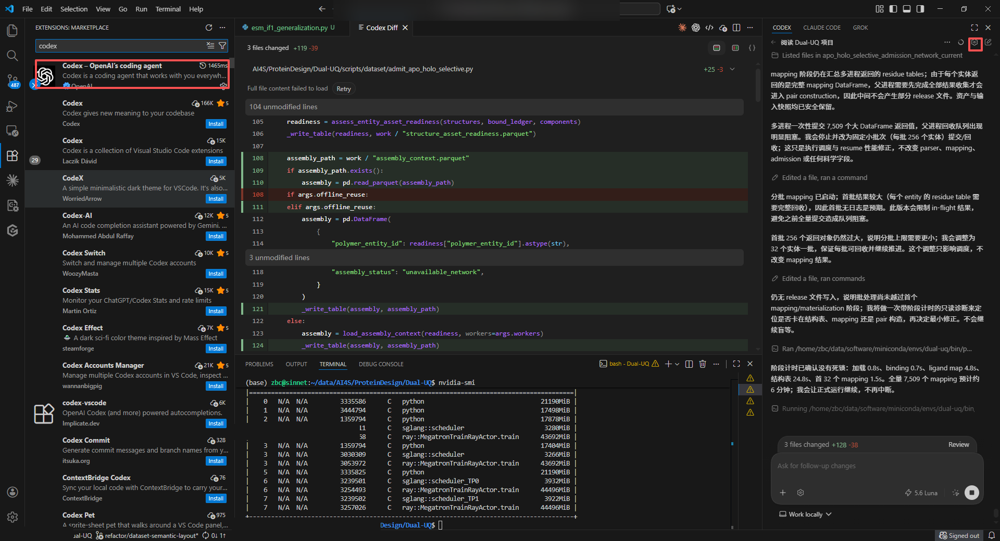
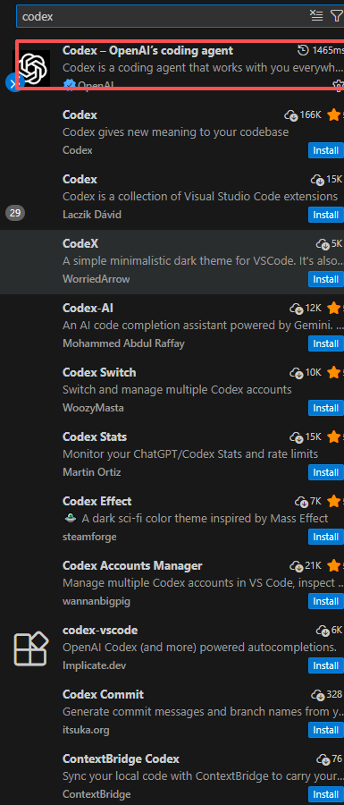
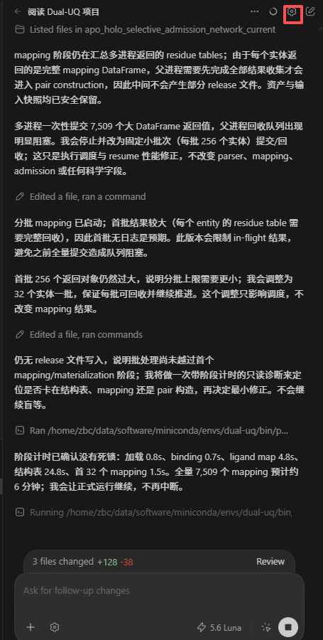
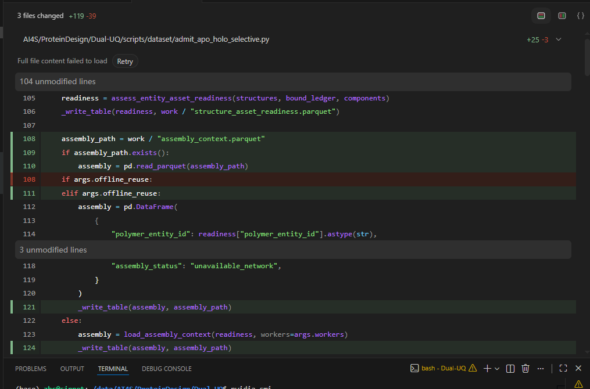
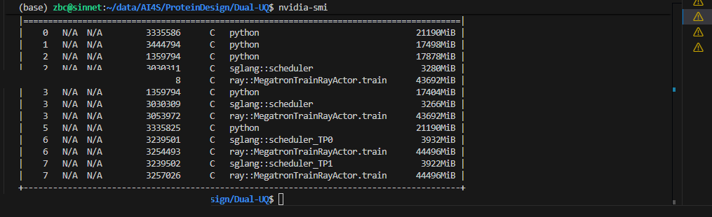

<style>
.quarto-title h1.title {
  font-size: 2.75rem !important;
  line-height: 1.12;
  letter-spacing: -0.02em;
}

@media (max-width: 768px) {
  .quarto-title h1.title {
    font-size: 2.2rem !important;
  }
}
</style>

A common research-computing workflow is to keep source code, Conda environments, datasets, checkpoints, and GPU workloads on a **remote Linux server**, while using **VS Code on a local Windows machine** as the editor.

With VS Code Remote-SSH, the interface stays on the local computer while the workspace, terminal, language servers, Git operations, and remote extensions operate against the Linux server. Codex can then be used in two complementary ways:

- through the **Codex IDE extension** in VS Code;
- through the **Codex CLI** in the remote Linux terminal.

The recommended architecture is:

```text
Windows workstation
│
├── VS Code
│   └── Remote - SSH
│
└──────────── SSH ───────────────┐
                                 │
                            Linux server
                                 │
                 ┌───────────────┴───────────────┐
                 │                               │
          VS Code Server                    Codex CLI
                 │                               │
          remote extensions                ~/.codex/
                 │                               │
          Codex IDE extension              project files
                 │
          project files / Git /
          Python / Conda / CUDA
```

This note focuses on a remote research-server setup and includes a troubleshooting section for failures involving:

- SSH authentication;
- VS Code Remote-SSH;
- `codex: command not found`;
- the Codex extension not finding the remote executable;
- browser authentication on a headless server;
- `localhost:1455` callback failures;
- proxy/Mihomo environments;
- TLS, DNS, timeout, and connection-reset errors;
- Git and remote-environment issues.

::: {.callout-important}
## Recommended workflow

Use:

**Windows VS Code → Remote-SSH → Linux project → Codex IDE extension + Codex CLI**

Use the IDE extension for code-context-aware editing and diff review. Keep the CLI installed and working on the server as the diagnostic baseline: if `codex` does not work in a normal remote shell, fix that before debugging the IDE integration.
:::

## 1. Prerequisites

### Local Windows machine

Install:

- Visual Studio Code;
- an OpenSSH-compatible SSH client;
- the Microsoft **Remote - SSH** extension;
- an SSH private key.

### Remote Linux server

The server should provide:

- SSH access;
- a normal non-root account;
- Git;
- internet access, either directly or through a proxy;
- write permission to the project directory.

Before involving VS Code, verify ordinary SSH from Windows:

```bash
ssh username@server.example.com
```

For a custom SSH port:

```bash
ssh -p 2222 username@server.example.com
```

The command-line SSH connection should work reliably before continuing.

## 2. Configure SSH keys

### 2.1 Inspect existing keys

From Git Bash:

```bash
ls -la ~/.ssh
```

Typical files are:

```text
id_ed25519
id_ed25519.pub
config
known_hosts
```

If no key exists:

```bash
ssh-keygen -t ed25519
```

The Windows path is normally:

```text
C:\Users\<WindowsUser>\.ssh\id_ed25519
```

### 2.2 Add the public key to Linux

If `ssh-copy-id` is available:

```bash
ssh-copy-id username@server.example.com
```

Otherwise display the public key:

```bash
cat ~/.ssh/id_ed25519.pub
```

Append it on the server to:

```text
~/.ssh/authorized_keys
```

Set conservative permissions:

```bash
chmod 700 ~/.ssh
chmod 600 ~/.ssh/authorized_keys
```

Test again:

```bash
ssh username@server.example.com
```

## 3. Configure `~/.ssh/config`

On Windows, edit:

```text
C:\Users\<WindowsUser>\.ssh\config
```

A minimal configuration is:

```sshconfig
Host lab-server
    HostName server.example.com
    User username
    Port 22
    IdentityFile ~/.ssh/id_ed25519
    ServerAliveInterval 60
    ServerAliveCountMax 3
```

For an IP address:

```sshconfig
Host gpu01
    HostName 192.0.2.10
    User username
    IdentityFile ~/.ssh/id_ed25519
```

Test the alias:

```bash
ssh lab-server
```

`lab-server` is only a local alias and does not need to match the Linux hostname.

## 4. Connect with VS Code Remote-SSH

In local VS Code:

1. install **Remote - SSH**;
2. press `Ctrl+Shift+P`;
3. run:

```text
Remote-SSH: Connect to Host...
```

4. choose:

```text
lab-server
```

After connection, the lower-left status area should indicate an SSH remote.


Figure @fig-vscode-overview shows the intended working state: VS Code is attached to a remote Linux workspace, the Codex extension is available inside the remote window, the editor shows a Codex-generated diff, and the integrated terminal is executing commands on the server.

{#fig-vscode-overview fig-alt="VS Code Remote-SSH session showing a remote Linux project, Codex Diff, Codex sidebar, and integrated terminal."}

A useful visual confirmation is the remote status indicator in the lower-left corner of VS Code. The exact hostname varies by server; the important point is that the active VS Code window is attached through SSH rather than operating on the local Windows filesystem.

Open a remote terminal:

```text
Terminal → New Terminal
```

Verify the environment:

```bash
hostname
whoami
pwd
uname -a
echo "$HOME"
echo "$SHELL"
```

A typical Linux result is:

```text
/home/username
/bin/bash
```

::: {.callout-warning}
## Confirm the terminal is remote

Before installing Codex or changing shell configuration, run:

```bash
hostname
pwd
uname -a
```

This prevents accidentally installing tools on Windows instead of on the Linux server.
:::

## 5. Open the remote project

In the remote VS Code window:

```text
File → Open Folder...
```

Choose a project folder such as:

```text
/home/username/projects/protein-design
```

or:

```text
/data/username/projects/protein-design
```

From the remote terminal:

```bash
cd ~/projects
git clone <repository>
cd <repository>
git status
```

If the `code` command is available in the remote terminal:

```bash
code .
```

Avoid opening very high-level filesystem roots such as `/data` if they contain many unrelated datasets and projects. Open the actual repository root instead.

## 6. Install Codex CLI on Linux

The current OpenAI standalone installer for macOS/Linux is:

```bash
curl -fsSL https://chatgpt.com/codex/install.sh | sh
```

Alternatively, if Node.js/npm is already available:

```bash
npm install -g @openai/codex
```

Verify:

```bash
codex --version
```

Locate the executable:

```bash
command -v codex
which codex
```

The standalone installer commonly installs the visible command into:

```text
~/.local/bin
```

### 6.1 Verify remote-shell visibility

A useful test from Windows is:

```bash
ssh lab-server 'command -v codex && codex --version'
```

If this fails while `codex --version` works in an interactive VS Code terminal, the problem is usually **shell initialization or PATH visibility**, not the Codex installation itself.

## 7. Fix `codex: command not found`

Inspect PATH:

```bash
echo "$PATH"
```

Check the common installer location:

```bash
ls -l ~/.local/bin/codex
```

Search if necessary:

```bash
find "$HOME" -type f -name codex 2>/dev/null | head
```

If the binary is under `~/.local/bin`, add it to Bash:

```bash
echo 'export PATH="$HOME/.local/bin:$PATH"' >> ~/.bashrc
source ~/.bashrc
```

For Zsh:

```bash
echo 'export PATH="$HOME/.local/bin:$PATH"' >> ~/.zshrc
source ~/.zshrc
```

Retest:

```bash
command -v codex
codex --version
```

Then test through a fresh SSH process:

```bash
ssh lab-server 'bash -lc "command -v codex && codex --version"'
```

If the IDE still cannot find Codex after the shell test succeeds:

1. close the remote VS Code window;
2. reconnect with Remote-SSH;
3. reload the remote window;
4. verify the Codex extension is enabled in the SSH environment.

## 8. Authenticate Codex on a headless Linux server

Codex supports ChatGPT-account authentication and API-key authentication.

For a remote/headless server, device-code authentication is usually the simplest path:

```bash
codex login --device-auth
```

Codex prints a URL and a one-time code. Open the URL on the local Windows browser, sign in, and complete the device-code flow.

Check authentication:

```bash
codex login status
```

Then run:

```bash
codex
```

### 8.1 Standard browser authentication

You can also run:

```bash
codex login
```

This starts the normal browser-based login flow. On a remote server, the localhost callback can fail because the browser is on Windows while Codex is listening on Linux.

### 8.2 API-key authentication

For usage-based API billing:

```bash
export OPENAI_API_KEY="YOUR_API_KEY"
printenv OPENAI_API_KEY | codex login --with-api-key
unset OPENAI_API_KEY
```

Check:

```bash
codex login status
```

Do not place keys in:

```text
README.md
AGENTS.md
tracked .env files
Git history
shell scripts committed to Git
```

## 9. Fix browser login and `localhost:1455` callback errors

A common remote-login failure is:

```text
browser opens successfully
→ login succeeds
→ browser redirects to localhost
→ connection refused / callback never reaches Codex
```

The reason is that `localhost` in the Windows browser means the **Windows computer**, whereas the Codex callback listener is running on the **Linux server**.

### Preferred solution: device code

Use:

```bash
codex login --device-auth
```

### Fallback: SSH port forwarding

Open a new local terminal on Windows:

```bash
ssh -L 1455:localhost:1455 lab-server
```

Inside that SSH session:

```bash
codex login
```

Keep the SSH tunnel open while completing authentication in the Windows browser.

### Fallback: copy an existing auth cache

On a trusted machine where normal browser login works:

```bash
codex login
```

The credential cache can exist at:

```text
~/.codex/auth.json
```

Copy it to the trusted remote machine:

```bash
ssh lab-server 'mkdir -p ~/.codex'
scp ~/.codex/auth.json lab-server:~/.codex/auth.json
```

Treat `auth.json` like a password. Never commit or share it.

## 10. Install and use the Codex VS Code extension

In the VS Code window already connected to Linux:


The official extension should be identified by the **OpenAI** publisher rather than by name alone, because the Marketplace also contains unrelated extensions with similar names.

{#fig-codex-extension fig-alt="VS Code Marketplace search results with the official Codex extension by OpenAI highlighted."}

After installation, a typical remote workflow exposes the Codex panel on the right side of the VS Code window:

{#fig-codex-sidebar fig-alt="Codex sidebar in VS Code showing a coding session in a remote repository."}


1. open **Extensions**;
2. install or enable the official **Codex** extension;
3. open the Codex sidebar.

If the icon is hidden:

```text
Ctrl+Shift+P
```

then:

```text
Codex: Open Codex Sidebar
```

The IDE extension is useful because it can work with open files, selected code, editor context, and in-place diffs.


One useful IDE-specific capability is reviewing changes as a diff before accepting or committing them:

{#fig-codex-diff fig-alt="VS Code Codex Diff view with added and removed source-code lines."}

The integrated terminal remains an independent diagnostic surface. It is useful for checking the actual remote Python environment, GPU state, Git status, network connectivity, and the Codex CLI:

{#fig-remote-terminal fig-alt="VS Code integrated terminal in a remote Linux session showing GPU process information."}


Useful requests include:

```text
Explain the selected function and identify numerical-stability risks.
Do not modify any files.
```

```text
Review the current Git diff and identify regressions.
```

```text
Refactor this module without changing the public API.
Run only the relevant unit tests.
```

## 11. Local vs remote extension state

VS Code Remote-SSH has separate local and remote execution contexts.

In the Extensions view, distinguish:

```text
Local
    Windows

SSH: lab-server
    Linux server
```

If Codex works locally but not in the remote workspace, inspect whether the extension is installed/enabled for the active SSH host.

After changing PATH, proxy variables, or Codex authentication, reconnect the Remote-SSH window so the remote extension host starts with a fresh environment.

## 12. Configure Codex

User-level configuration is stored in:

```text
~/.codex/config.toml
```

Create the directory:

```bash
mkdir -p ~/.codex
```

Edit:

```bash
nano ~/.codex/config.toml
```

A conservative starting configuration is:

```toml
approval_policy = "on-request"
sandbox_mode = "workspace-write"

[sandbox_workspace_write]
network_access = false
```

This allows normal workspace edits while keeping generated command execution bounded and outbound network access disabled by default.

Inspect the active session inside Codex:

```text
/status
```

Inspect or change permissions:

```text
/permissions
```

### 12.1 Project-scoped configuration

A trusted repository may also use:

```text
.codex/config.toml
```

For example:

```text
protein-design/
├── .codex/
│   └── config.toml
├── AGENTS.md
├── src/
├── tests/
└── README.md
```

Do not put credentials in project-scoped Codex configuration.

## 13. Add project instructions with `AGENTS.md`

Codex can automatically load repository instructions from `AGENTS.md`.

From the Codex CLI, a starter file can be scaffolded with:

```text
/init
```

For a research repository, a practical version is:

```markdown
# AGENTS.md

## Project

This repository contains protein-design and protein-language-model experiments.

## Environment

- Linux server
- Python 3.11
- PyTorch
- CUDA
- Conda environment: protein-design

## Safety

- Do not delete datasets or checkpoints.
- Do not modify files under `data/raw/`.
- Do not launch distributed or multi-GPU training unless explicitly requested.
- Do not install packages globally.
- Do not modify SSH credentials or proxy credentials.
- Ask before deleting files or rewriting Git history.

## Development

- Prefer the existing Conda environment.
- Run only lightweight tests unless a longer run is explicitly requested.
- Preserve existing configuration interfaces.
- Show the Git diff before a destructive refactor.
```

Commit it:

```bash
git add AGENTS.md
git commit -m "docs: add Codex project instructions"
```

## 14. Conda, Python, and GPU environments

Check Conda:

```bash
conda env list
```

Activate the intended environment:

```bash
conda activate protein-design
```

Verify:

```bash
which python
python --version
```

For PyTorch/CUDA:

```bash
python - <<'PY'
import torch
print("PyTorch:", torch.__version__)
print("CUDA available:", torch.cuda.is_available())
if torch.cuda.is_available():
    print("GPU:", torch.cuda.get_device_name(0))
PY
```

Tell Codex which environment to use:

```text
Use the existing Conda environment `protein-design`.
Do not create a new environment.
Do not install packages globally.
```

For a shared GPU server:

```text
Do not start training, distributed jobs, or GPU-intensive benchmarks.
You may inspect code and configuration, but ask before launching workloads.
```

For Slurm:

```text
Do not run training directly on the login node.
Prepare or edit the sbatch script and show it to me before submission.
```

## 15. Use Codex with Mihomo or another proxy

This section is relevant when the Linux server cannot directly reach ChatGPT/OpenAI services and you are already running a local proxy such as Mihomo.

Assume Mihomo exposes:

```text
127.0.0.1:7890
```

as a mixed HTTP/SOCKS port.

For the current shell:

```bash
export HTTP_PROXY=http://127.0.0.1:7890
export HTTPS_PROXY=http://127.0.0.1:7890
export http_proxy=$HTTP_PROXY
export https_proxy=$HTTPS_PROXY
```

If SOCKS is required:

```bash
export ALL_PROXY=socks5h://127.0.0.1:7890
export all_proxy=$ALL_PROXY
```

Inspect:

```bash
env | grep -i proxy
```

Test basic connectivity:

```bash
curl -I https://chatgpt.com
```

and:

```bash
curl -I https://api.openai.com
```

A response such as HTTP `401`, `403`, or another normal HTTP status still proves that DNS, TCP, TLS, and HTTP connectivity reached the remote service. A timeout, DNS error, or connection reset indicates a lower-level networking problem.

### 15.1 Make proxy variables available to Remote-SSH

Microsoft notes that local Windows proxy settings are not automatically reused by the remote host. Configure the proxy on Linux.

For Bash:

```bash
cat >> ~/.bashrc <<'EOF'
export HTTP_PROXY=http://127.0.0.1:7890
export HTTPS_PROXY=http://127.0.0.1:7890
export http_proxy=$HTTP_PROXY
export https_proxy=$HTTPS_PROXY
EOF
```

Reload:

```bash
source ~/.bashrc
```

Then reconnect the VS Code Remote-SSH window.

Verify in the new remote terminal:

```bash
env | grep -i proxy
```

If Codex CLI works but the IDE extension still fails, fully close and reopen the remote VS Code window so its extension host is restarted with the updated environment.

### 15.2 Proxy helper functions

If you do not want the proxy enabled permanently:

```bash
proxy_on() {
    export HTTP_PROXY=http://127.0.0.1:7890
    export HTTPS_PROXY=http://127.0.0.1:7890
    export http_proxy=$HTTP_PROXY
    export https_proxy=$HTTPS_PROXY
    export ALL_PROXY=socks5h://127.0.0.1:7890
    export all_proxy=$ALL_PROXY
}

proxy_off() {
    unset HTTP_PROXY HTTPS_PROXY http_proxy https_proxy ALL_PROXY all_proxy
}
```

Then:

```bash
proxy_on
codex
```

Disable:

```bash
proxy_off
```

## 16. Diagnostic workflow

When something fails, debug from the bottom of the stack upward.

### Layer 1: SSH

From Windows:

```bash
ssh lab-server
```

### Layer 2: remote shell

```bash
hostname
whoami
echo "$HOME"
echo "$SHELL"
```

### Layer 3: internet

```bash
curl -I https://chatgpt.com
```

### Layer 4: Codex executable

```bash
command -v codex
codex --version
```

### Layer 5: authentication

```bash
codex login status
```

### Layer 6: Codex CLI

```bash
cd /path/to/project
codex
```

### Layer 7: IDE integration

Only after the CLI works should you debug the VS Code Codex extension.

This ordering avoids treating a network, PATH, or authentication problem as an IDE-extension problem.

## 17. Troubleshooting by error message

### 17.1 `Permission denied (publickey)`

Check which key SSH uses:

```bash
ssh -vvv lab-server
```

Confirm:

```sshconfig
Host lab-server
    HostName server.example.com
    User username
    IdentityFile ~/.ssh/id_ed25519
```

On Linux:

```bash
chmod 700 ~/.ssh
chmod 600 ~/.ssh/authorized_keys
```

Check that the correct public key is present:

```bash
cat ~/.ssh/authorized_keys
```

### 17.2 SSH works in Git Bash but VS Code fails

Windows can contain multiple SSH clients.

Git Bash:

```bash
which ssh
ssh -V
```

PowerShell:

```powershell
Get-Command ssh
ssh -V
```

VS Code may be invoking a different SSH binary than the one you tested.

Open:

```text
View → Output → Remote - SSH
```

Inspect the executable and command VS Code actually launches.

### 17.3 Remote-SSH hangs while installing VS Code Server

Check remote internet access:

```bash
curl -I https://code.visualstudio.com
```

Check disk space:

```bash
df -h
```

Check quota where applicable:

```bash
quota -s
```

If the server is behind a proxy:

```bash
export HTTP_PROXY=http://127.0.0.1:7890
export HTTPS_PROXY=$HTTP_PROXY
```

Then reconnect.

Also inspect:

```text
View → Output → Remote - SSH
```

### 17.4 `/tmp` is mounted `noexec`

Some hardened servers prevent executing installer scripts from `/tmp`.

Check:

```bash
mount | grep ' /tmp '
```

If `noexec` is present, the VS Code Server installer may fail. This normally requires coordination with the server administrator or an approved alternative temp directory.

### 17.5 `codex: command not found`

Check:

```bash
ls -l ~/.local/bin/codex
echo "$PATH"
command -v codex
```

Fix:

```bash
export PATH="$HOME/.local/bin:$PATH"
```

Persist for Bash:

```bash
echo 'export PATH="$HOME/.local/bin:$PATH"' >> ~/.bashrc
```

Reconnect VS Code after the change.

### 17.6 Codex works in terminal but the VS Code extension says it cannot find Codex

This usually indicates that the terminal and extension host started with different environments.

Test a fresh SSH shell:

```bash
ssh lab-server 'bash -lc "command -v codex && codex --version"'
```

If that succeeds:

1. close the remote VS Code window;
2. reconnect;
3. reload the window;
4. confirm the Codex extension is enabled for `SSH: lab-server`.

If it fails, fix the remote login-shell PATH first.

### 17.7 `Failed to start Codex`, `spawn codex ENOENT`, or similar startup errors

Interpret `ENOENT` first as “the process could not find the executable or a required path”.

Run:

```bash
command -v codex
ls -l "$(command -v codex)"
codex --version
```

Then:

```bash
ssh lab-server 'bash -lc "command -v codex"'
```

If the CLI is installed through a user-specific package manager, ensure that package manager's binary directory is available in the remote shell PATH.

### 17.8 Browser login succeeds but terminal waits forever

Prefer:

```bash
codex login --device-auth
```

If standard login is required:

```bash
ssh -L 1455:localhost:1455 lab-server
```

and then on Linux:

```bash
codex login
```

### 17.9 Device-code login is unavailable

Device-code login can depend on ChatGPT account or workspace settings.

First try:

```bash
codex login --device-auth
```

If the flow is not allowed, use one of the fallback methods:

- standard login through an SSH tunnel;
- API-key login;
- authenticate on another trusted machine and securely copy the credential cache.

### 17.10 `401 Unauthorized` or authentication repeatedly expires

Check:

```bash
codex login status
```

Reset the local authentication state:

```bash
codex logout
codex login --device-auth
```

If using an API key:

```bash
printenv OPENAI_API_KEY | codex login --with-api-key
```

Do not mix a stale ChatGPT login and a newly intended API-key workflow without checking `codex login status`.

### 17.11 `Could not resolve host`

Check DNS:

```bash
getent hosts chatgpt.com
getent hosts api.openai.com
```

Also:

```bash
cat /etc/resolv.conf
```

Test:

```bash
curl -I https://chatgpt.com
```

If direct DNS is blocked but Mihomo is available, use the proxy and retest.

### 17.12 `Connection timed out`

Check general routing:

```bash
ip route
```

Check proxy state:

```bash
env | grep -i proxy
```

Test proxy:

```bash
curl -x http://127.0.0.1:7890 -I https://chatgpt.com
```

If this succeeds while a direct request fails, Codex needs the proxy environment.

### 17.13 `Connection reset by peer` / `ECONNRESET`

First determine whether the reset is specific to Codex:

```bash
curl -v https://chatgpt.com
```

With Mihomo:

```bash
curl -v -x http://127.0.0.1:7890 https://chatgpt.com
```

If proxying fixes the request, verify that Codex and the VS Code remote extension host inherit the same proxy variables.

### 17.14 TLS or certificate errors

Inspect:

```bash
curl -v https://chatgpt.com
```

If the network uses an institutional TLS-inspection proxy or private CA, Codex supports a custom CA bundle through:

```bash
export CODEX_CA_CERTIFICATE=/path/to/corporate-root-ca.pem
```

Then:

```bash
codex login
```

Only use a trusted CA bundle supplied by the institution or administrator.

### 17.15 CLI login fails with no obvious reason

Codex writes a login-specific diagnostic log.

Inspect the Codex log directory:

```bash
find ~/.codex -maxdepth 2 -type f | sort
```

Look for:

```text
codex-login.log
```

Do not publish logs without reviewing them for sensitive metadata.

### 17.16 Extension installs locally but not remotely

In the Extensions panel, inspect both:

```text
Local
SSH: lab-server
```

When VS Code offers **Install in SSH: lab-server**, use the remote installation where required by the extension.

Restart the remote extension host after installation.

### 17.17 Git push hangs in remote VS Code

If the repository uses an SSH key protected by a passphrase, some VS Code remote Git UI operations can wait for authentication.

Test from the remote terminal:

```bash
git status
git remote -v
git push
```

If the terminal works reliably, use terminal Git commands for that server workflow.

### 17.18 Codex cannot run commands that require network access

Local Codex sandbox settings can intentionally disable network access.

Inspect:

```text
/permissions
```

and:

```text
/status
```

If your configuration includes:

```toml
[sandbox_workspace_write]
network_access = false
```

then network access from agent-generated commands is intentionally restricted.

Do not solve this by enabling unrestricted access globally unless the project requires it. Prefer explicit approval or narrowly scoped permissions.

## 18. Useful diagnostics to collect

Before asking for help, collect:

```bash
hostname
uname -a
cat /etc/os-release
```

```bash
echo "$SHELL"
echo "$PATH"
env | grep -i proxy
```

```bash
command -v codex
codex --version
codex login status
```

```bash
git status
git branch --show-current
```

For SSH:

```bash
ssh -vvv lab-server
```

For network:

```bash
curl -v https://chatgpt.com
```

For proxy:

```bash
curl -v -x http://127.0.0.1:7890 https://chatgpt.com
```

When sharing diagnostics, redact:

- IP addresses if sensitive;
- usernames if sensitive;
- API keys;
- tokens;
- `auth.json`;
- private SSH keys;
- subscription URLs;
- cookies.

## 19. Recommended Git workflow with Codex

Before asking Codex to edit:

```bash
git status
git branch --show-current
```

For substantial changes:

```bash
git switch -c codex/<task-name>
```

Optionally create a checkpoint:

```bash
git add -A
git commit -m "checkpoint: before Codex changes"
```

After Codex edits:

```bash
git status
git diff
```

Run tests:

```bash
pytest -q
```

Stage intentionally:

```bash
git add <files>
```

Review staged changes:

```bash
git diff --cached
```

Commit:

```bash
git commit -m "refactor: <description>"
```

Avoid giving an agent a default workflow that rewrites Git history, force-pushes, deletes branches, or removes large directories without approval.

## 20. Use `tmux` for long Codex sessions

For long remote work:

```bash
tmux new -s codex
```

Then:

```bash
cd ~/projects/<repository>
codex
```

Detach:

```text
Ctrl+B
D
```

Reconnect:

```bash
tmux attach -t codex
```

This keeps the shell session alive if VS Code or SSH disconnects.

## 21. Jump-host configuration

For an internal GPU node behind a login server:

```sshconfig
Host login-server
    HostName login.example.com
    User username
    IdentityFile ~/.ssh/id_ed25519

Host gpu-server
    HostName gpu01.internal
    User username
    IdentityFile ~/.ssh/id_ed25519
    ProxyJump login-server
```

Test:

```bash
ssh gpu-server
```

Then use `gpu-server` in VS Code Remote-SSH.

## 22. Recommended server layout

A clean user-level layout is:

```text
/home/username/
├── .ssh/
├── .codex/
│   ├── config.toml
│   └── auth.json
└── projects/
    └── protein-design/
        ├── .git/
        ├── .codex/
        │   └── config.toml
        ├── AGENTS.md
        ├── src/
        ├── tests/
        └── README.md
```

Keep large research artifacts outside Git:

```text
/data/username/
├── datasets/
├── checkpoints/
└── outputs/
```

Protect those locations explicitly in `AGENTS.md`.

## 23. Quick start

### Windows SSH config

```sshconfig
Host lab-server
    HostName server.example.com
    User username
    IdentityFile ~/.ssh/id_ed25519
```

Test:

```bash
ssh lab-server
```

### VS Code

```text
Ctrl+Shift+P
→ Remote-SSH: Connect to Host...
→ lab-server
```

### Remote Linux terminal

Install Codex:

```bash
curl -fsSL https://chatgpt.com/codex/install.sh | sh
```

Verify:

```bash
command -v codex
codex --version
```

Authenticate:

```bash
codex login --device-auth
```

Check:

```bash
codex login status
```

Open the project:

```bash
cd ~/projects/<repository>
git status
```

Start Codex:

```bash
codex
```

Then install/enable the Codex VS Code extension in the active SSH workspace and open:

```text
Codex: Open Codex Sidebar
```

## 24. Minimal recovery sequence

When the setup suddenly stops working, run this sequence:

```bash
ssh lab-server
```

```bash
hostname
command -v codex
codex --version
```

```bash
env | grep -i proxy
curl -I https://chatgpt.com
```

```bash
codex login status
```

If login is broken:

```bash
codex logout
codex login --device-auth
```

If CLI works but VS Code does not:

```text
Close remote window
→ reconnect Remote-SSH
→ verify Codex extension under SSH: lab-server
→ Codex: Open Codex Sidebar
```

If the CLI cannot reach the network but Mihomo is running:

```bash
export HTTP_PROXY=http://127.0.0.1:7890
export HTTPS_PROXY=$HTTP_PROXY
codex
```

This sequence isolates most failures into one of four categories:

```text
SSH
PATH
network/proxy
authentication
```

## References

- [OpenAI Codex CLI documentation](https://developers.openai.com/codex/cli)
- [OpenAI Codex authentication documentation](https://developers.openai.com/codex/auth)
- [OpenAI Codex IDE extension documentation](https://developers.openai.com/codex/ide)
- [OpenAI Codex configuration reference](https://developers.openai.com/codex/config-reference)
- [OpenAI Codex AGENTS.md documentation](https://developers.openai.com/codex/agent-configuration/agents-md)
- [OpenAI Codex sandbox and approvals documentation](https://developers.openai.com/codex/agent-approvals-security)
- [Microsoft VS Code Remote-SSH documentation](https://code.visualstudio.com/docs/remote/ssh)
- [Microsoft Remote Development troubleshooting](https://code.visualstudio.com/docs/remote/troubleshooting)
